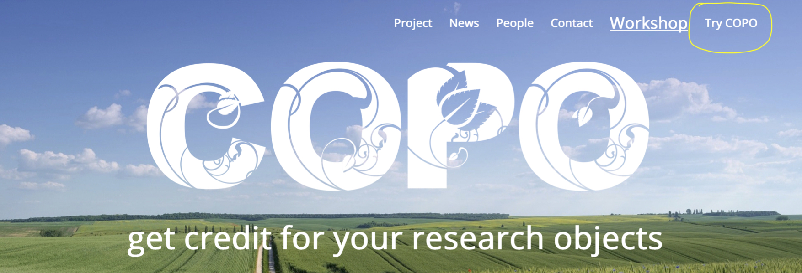
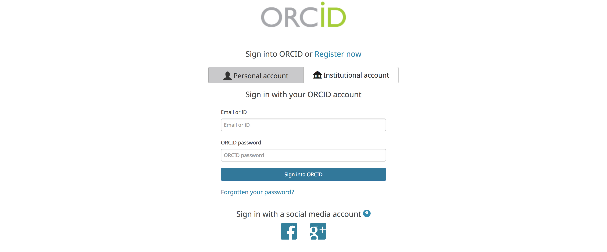
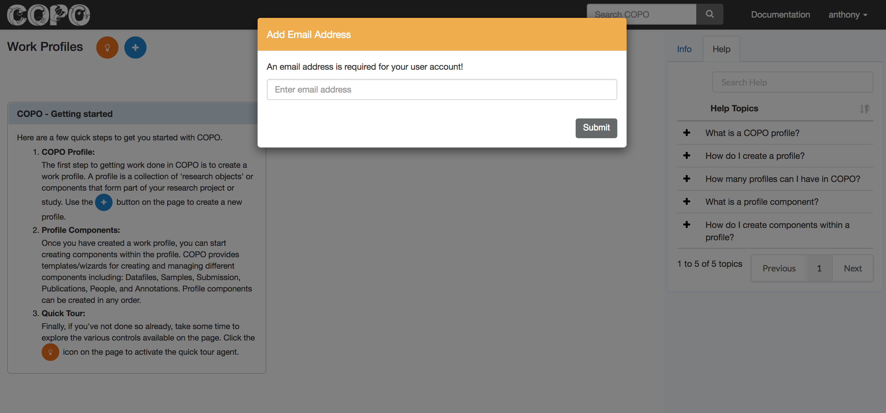
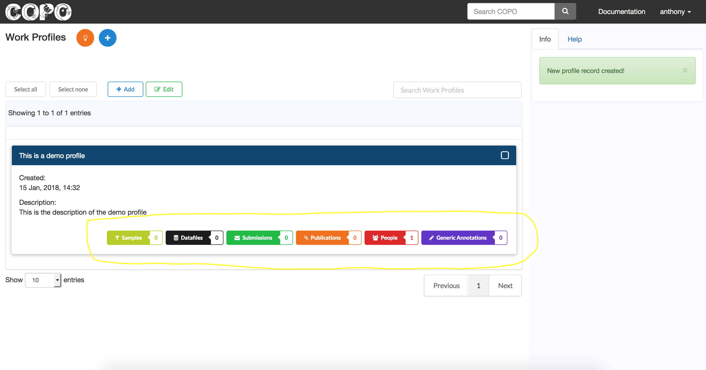

####################
Getting started
####################

The project home page is at: https://copo-project.org. You need an ORCID ID to access the application. 

.. hint::

   You can register for an ORCID ID at the `ORCID website <https://orcid.org/signin/>`_. It's free!

Click on **Try COPO** at the top right corner of the home page (see the image above) to proceed to the login page. This should lead to the ORCID sign in page:

Enter your login credentials, or click **Register now** to register a new ORCID account. If the login is successful, a redirection should be made to COPO application.

First time login
------------------

If signing in for the first time a prompt, requesting for an email address, is displayed. Enter an email address to move on. The email address supplied will be associated with the user's account, and used in COPO for tasks (e.g., depositing to remote repositories) involving the user. 
   

A successful login leads to the main work page, which holds all the **work profiles** associated with a user. 

.. _profile-definition:  

##########################
Creating a Work Profile
##########################
The first step in getting any meaningful work done in COPO is to define a work profile. Follow these steps to create a work profile:

.. note::

   A COPO profile is a collection of *research objects* or components that form part of a research project or study. 

1. Click the **Add new record** icon to present a form 
2. Provide details of the new profile 
#. Click the save button to create the profile

.. note::

   Any number of profiles may be created, as required, to represent different projects or sub-projects within a larger project. 
   

Following is a graphical representation of the outlined stages. 

Click the add icon

.. image:: images/create-profile-button.png

.. note::

   Where possible, a highlight of important controls to watch out for is provided alongside the screenshot. 

Fill out the profile form, supplying the title and description of the work profile.

.. image:: images/profile-form.png

.. hint::

   Form fields in COPO come with a help tip. This functionality can be turned off by toggling the **Help tips** control (see the highlight in the **Add Profile** form screenshot).
   
   
##########################
Profile Components
##########################
A COPO profile (see :ref:`profile-definition`) comes with a predefined set of component types from which different research objects can be created. COPO currently defines the following component types:

1. Samples - for creating instances of biological samples
2. Datafiles - for uploading and attributing metadata to data
#. Publications - for associating publications resulting from and/or relevant to a project
#. People - for entering information about collaborators on a project
#. Annotations - for annotating different file types (e.g., PDFs, Spreadsheets) with relevant metadata 

   

