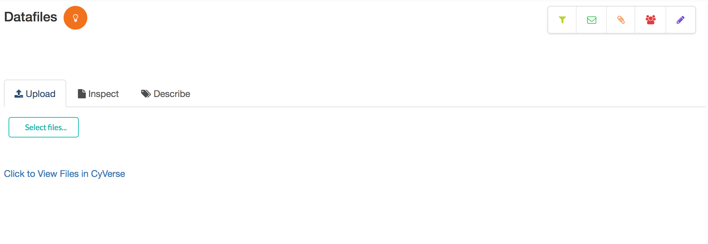
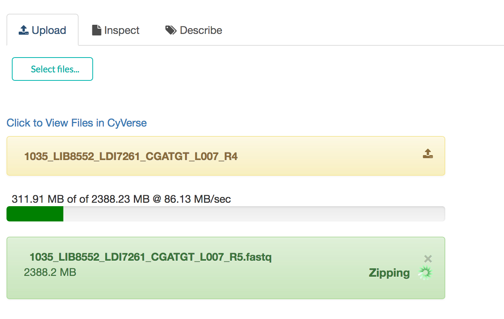
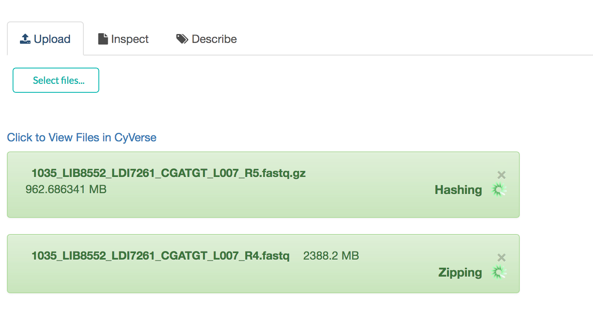
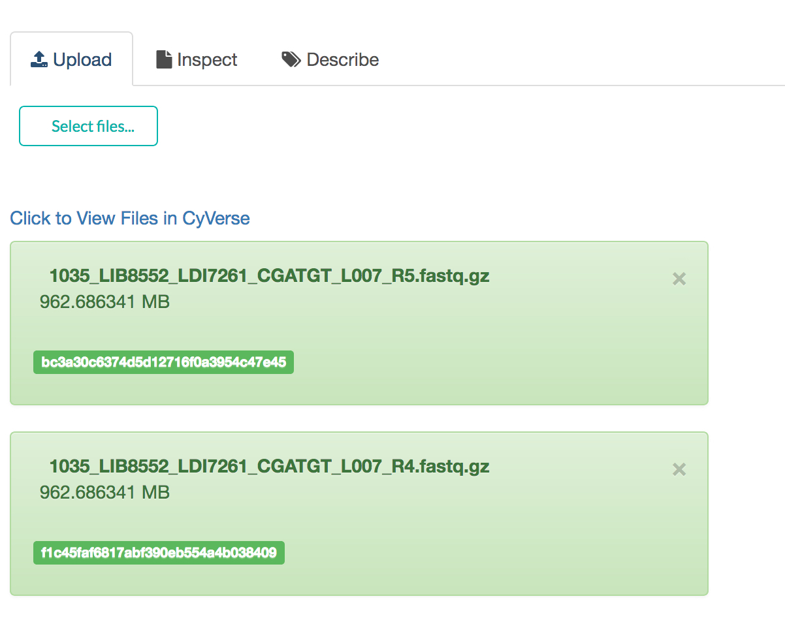
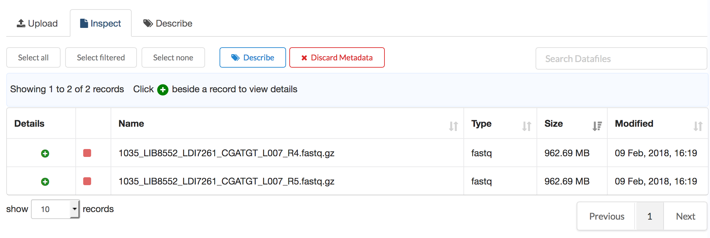
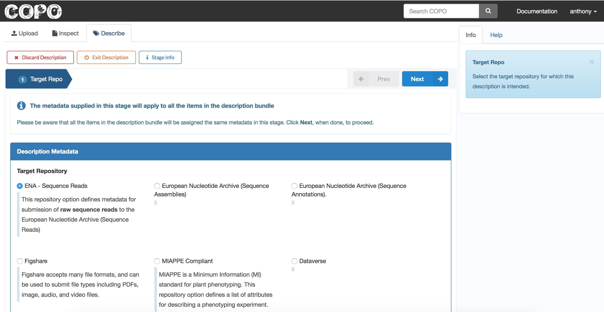
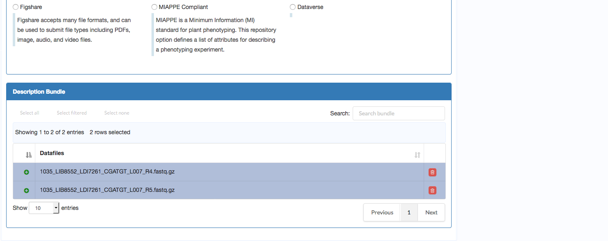

####################
Datafiles
####################

Datafile is one of the core components of a COPO profile. Within this page, the user can perform the following tasks:

1. **Upload** datafiles to COPO
2. **Inspect** or view the uploaded files
#. **Describe** or attribute metadata to the uploaded files

The screenshot shows the datafile page, with tabs to represent the key tasks mentioned (i.e., upload, inspect, and describe). Clicking a tab reveals the underlying view and controls to carry out actual work.

Upload
----------

Follow these steps to upload datafiles to COPO:

1. Click the **Upload** tab to reveal the file upload view (see screenshot above).
2. Within the upload pane, click the **Select files...** button. This should open a file browser.
#. Select one or more files to upload.

The selected files are uploaded to COPO. The upload process might involve compressing the datafiles (for large files), and `hashing` (for subsequent integrity verifications).

The process is demonstrated using the screenshots below. Two files were selected for upload; each approximately :code:`2GB` in size. The files are uploaded, compressed, and hashed. 

.. warning::
   In order to speed up the upload process, and for general user experience, it is advised that large files (e.g., size >=1GB) be compressed (using gzip) before  uploading them to COPO.

In the screenshot below, the displayed files have successfully been through the upload process. For each file, the name, extension (:code:`.gz` added if compressed), size (which now reflects the modified size after compression), and the hash value are displayed.

.. note::
   While COPO is positioned to broker the submission of data to remote repositories, it is not equipped to serve as a `silo` for datafiles. Uploaded datafiles are held only for a short period of time, pending deposition of such to remote repositories.

Inspect
----------
The inspect pane provides a view to the datafiles within a profile.

The presented view (see screenshot above) displays the two files uploaded to COPO. The file type has been identified as `fastq`. In general, the inspect view is consistent [#consistency_in_view]_ with the view discussed under the :ref:`sample detail view <sample-detail-view>` section. The user can reference that section for a description of overlapping controls. 

.. note::
   COPO tries to determine, and display accordingly, the type of an uploaded datafile. Where this is not possible, the type will be displayed as `unknown`. However, this does not disrupt the actions the user can perform on such files.
   

Tasks can be performed on a single datafile or a group of datafiles (bundle). Some of the relevant tasks defined for datafiles are:

Describe
	Click this button to describe selected datafiles. This would activate the description wizard, enabling the process of metadata attribution for the target files. 
	
	As mentioned, the user can either describe a single file or a bundle of files. This process will be discussed subsequently in more detail.  
	
Discard Metadata
	 Click this button to remove associated metadata on selected datafiles. 
	 
	 .. hint::
	    A **metadata indicator** is a visual cue beside a datafile record with information about its metadata level. In the screenshot above, the metadata indicator is represented by the red square beside a datafile record, and this indicates the absence of metadata. The user can hover over the indicator for state information. 

Datafile Description
---------------------
COPO supports, and provides relevant description templates for, submission of datafiles to a number of repositories (e.g., `ENA <https://www.ebi.ac.uk/ena/>`_, `Figshare <https://figshare.com>`_). 

Before embarking on datafile description, the user might want to give some thought about the end-point (i.e., the intended repository) of the target datafiles. For instance, certain file types might only be suitable for submission to specific repositories.

Irrespective of the description template used or the intended repository, the general process of datafile description is relatively similar. Any discrepancy in using any particular template will be highlighted where relevant.

Select the target files
--------------------------
The first step involves selecting the files to be described or the `description bundle`. The user can select a single file or multiple files. 

.. note::
	Multiple file description is useful (and possible) in situations where the files to be described would have similar metadata, and be potentially submitted to the same repository.
	
1.	Select the files to be described
2.	Click the **Describe** button

.. image:: images/datafile-select-files.jpg

The datafiles are validated for suitability of being described together, and the user would be expected to confirm the `bundling` action (see the screenshot below).

.. note::
	The confirmation dialog `might` not be displayed in a single file description.

.. image:: images/datafile-bundling-confirm.jpg

3. Click **Continue** to confirm the bundling

The view should switch to display the description wizard.

The description wizard
-------------------------

The screenshots above illustrate the datafile description wizard.

.. rubric:: Footnotes

.. [#consistency_in_view] A certain level of UI consistency will be maintained, were possible, across profile components.

