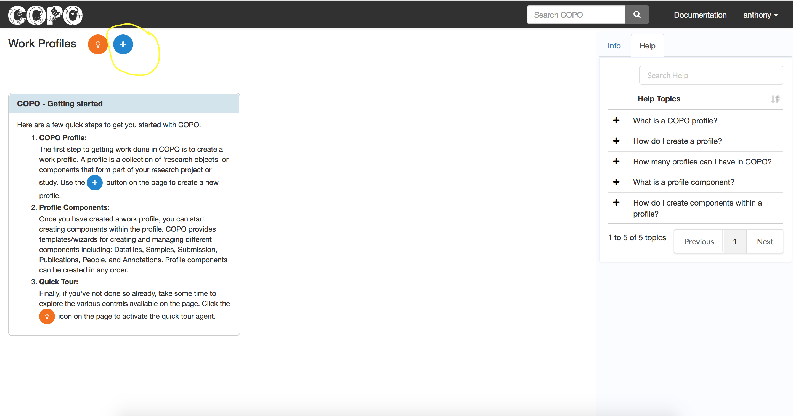

####################
Datafiles
####################

1. Click the **Add new record** icon to present a form 

.. note::

   Where applicable, a highlight of important controls to watch out for on a page is provided on the screenshot. 

2. Provide details of the new profile and click **Save**

.. image:: images/profile-form.png

.. hint::

   Form fields in COPO come with a help tip. This functionality can be turned off by toggling the **Help tips** control (see the highlight in the **Add Profile** form screenshot).
   