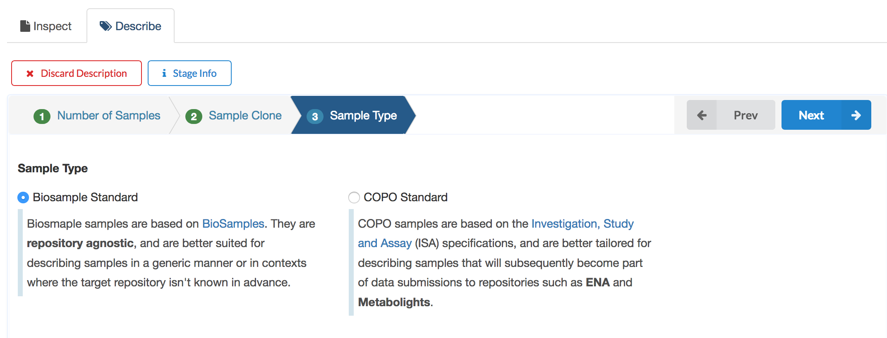
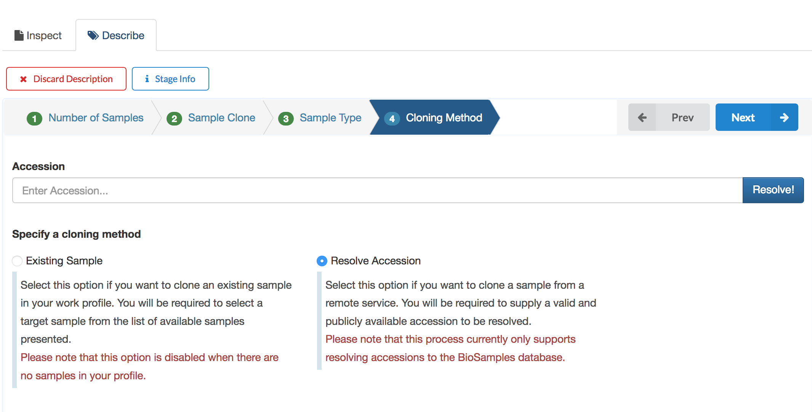
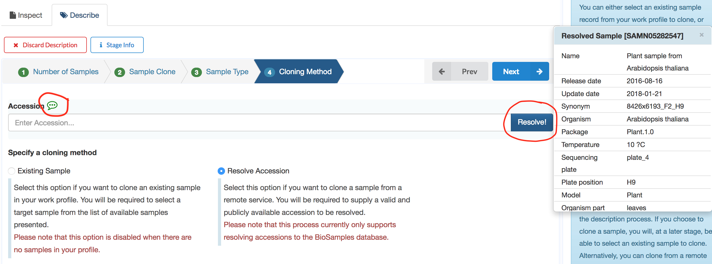
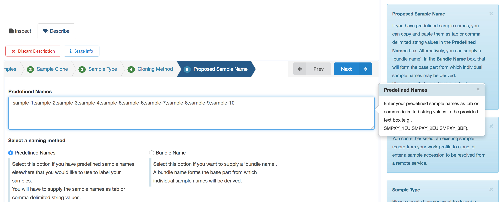
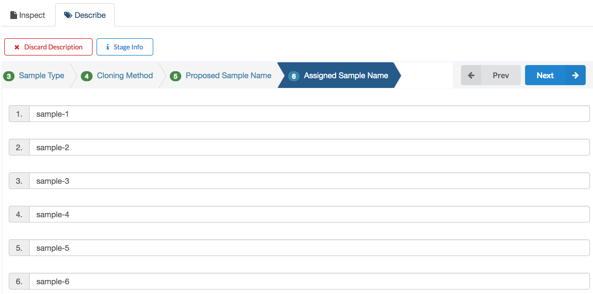
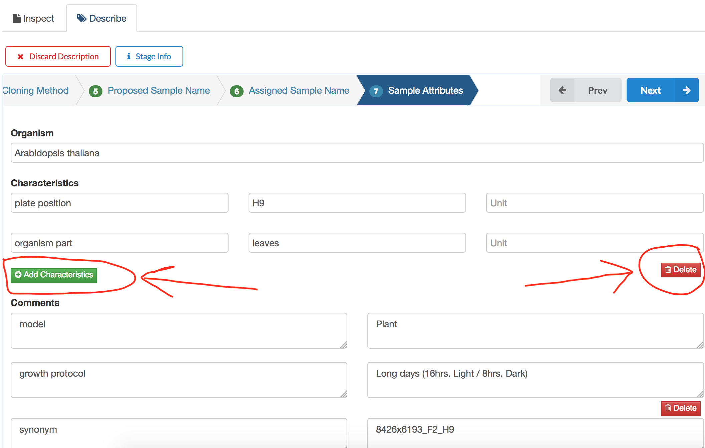

####################
Samples
####################

The samples page enables users to describe and manage biological samples. 

Samples within a profile can be linked to, or form part of, other components within a profile. For instance, a sample may be linked to a datafile as a metadata. The screenshot below shows the sample page before any record has been added.

.. image:: images/sample1.jpg

COPO provides a wizard to aid in the process of entering samples. 

Initiate the sample wizard
----------------------------

To initiate the sample wizard, click the **Describe samples** icon (see the highlighted blue icon in the screenshot above).

.. hint:: 

   The sample description wizard is a sequence of steps that guides the user through the process of describing samples.
   
Number of samples 
------------------

Enter the number of samples to describe in the first stage of the wizard. 

.. hint:: 

   Multiple sample having a common set of attributes can be described in a batch.

.. image:: images/sample-no-of-samples.jpg

Before proceeding through wizard stages, there are a few controls worth pointing out on the page. The screenshot above will be used as a point of reference.

Discard Description (left side of the wizard)
   Click this to discard and exit the current description. Please not that this action is irreversible.

Stage Info (next to the discard description button)
   Click this at any stage of the description to display information relevant to the stage.
   
Prev & Next (right side of the wizard)
   Use this to go forward and backward through the description stages
   
Info panel (right side corner of the page)
   This panel displays information about user interaction within a component page (e.g., feedback after record creation). In the wizard description context, it displays stage information as a user goes through different stages of a description.
   
Help panel (right side corner of the page)
   Click this tab to access context-based help about the samples page. This panel is also available to other components (e.g., Datafile)

Sample cloning
------------------
When describing new samples, the user can choose to inherit metadata from an existing sample. This may be useful in situations where the samples to be described have similar attributes to some reference sample. This functionality is set to **No** by default. Set the option to **Yes** if sample cloning is desired. In this guide, the clone option is selected to explore this functionality.

.. image:: images/sample-clone.jpg

Sample type
---------------
COPO provides a number of templates for describing samples defined by sample types. By selecting a particular sample type, the user can tailor the sample metadata towards a specific work process (e.g., submission to a particular repository).
   
The default sample type is **COPO Standard**. In the screenshot below, **Sample type** is set to **Biosample Standard**. However, this guide will highlight results from both types when relevant.

.. hint:: 

   The **Biosample Standard** sample type is useful for describing repository agnostic samples. **COPO Standard** is the recommended type to use for submissions to the `European Nucleotide Archive <https://www.ebi.ac.uk/ena>`_.

Cloning method
---------------
The cloning method stage is presented if sample clone was selected in a previous stage. The user can select, either from a local sample collection or by resolving an accession to a remote database, the reference sample to clone.

.. note:: 

   The **Existing Sample** option is only active if there are available samples in the current profile. Samples from other profiles are not available to be cloned in this view. **Resolve Accession** is the default option when there are no existing samples in a profile.
   
Results from both options will be highlighted in this guide where relevant. Also, for demonstration purposes, the accession - **SAMN05282547** (valid at the time of writing) is selected to be resolved.   

.. note:: 

   COPO currently supports resolving sample accessions to the `BioSamples <https://www.ebi.ac.uk/biosamples/>`_  database. 
   

  
Enter an accession and press the **Resolve!** button, located to the right of the accession input box.
  

The screenshot above shows the result of resolving the accession, **SAMN05282547**, the metadata of which is displayed on the pop-up box to the right. Also, the highlighted (in red circle) icon next to the **Accession** label, when hovered over also reveals the resolved sample metadata. 

The resolved attributes from this sample will form the basis of the current description. This will be demonstrated at a later stage.

.. warning:: 

   If an accession can't be resolved, an error will be displayed to inform the user. In that case, the user can either select a sample locally to clone (if there are any in the profile) or simply move on to the next stage.

   
Proposed sample name
---------------------
The proposed sample name stage provides the user the opportunity to name the prospective samples. Two options are available to the user, each of which fits a specific naming use-case:

1. Predefined Names (default option)
2. Bundle Name

The **Predefined Names** option is relevant in cases where the user has existing sample names. The sample names can come from a column in a spreadsheet,  or from a comma/tab separated list of names. To use this option, copy the sample names and paste in the **Predefined Names** input box and click the **Next** button to proceed. The screenshot above points to an example with comma separated list of sample names.

The  **Bundle Name** option will come in handy for users with no predefined sample names. If selected, the user will be required to enter a **bundle name**.

.. note::

   A **bundle name** is a prefix from which similar sample names may be derived. For example, if a user enters *sample-* as a bundle name, COPO would use this entry to generate sample names of the form: *sample-1, sample-2, sample-3*, etc.

Assigned sample name
---------------------

In this stage, the sample names for the prospective samples are generated. Sample names are unique in COPO, and the validation to satisfy this constraint is done before generating the names. The user can modify any of the generated names by simply entering a new name in a desired name field. Click the **Next** button to proceed.

.. warning::

   The validation for unique sample names can lead to errors and the rejection of a proposed name. To work around this, supply a new name in the affected field before proceeding to a next stage.
   
Sample attributes
---------------------

  

