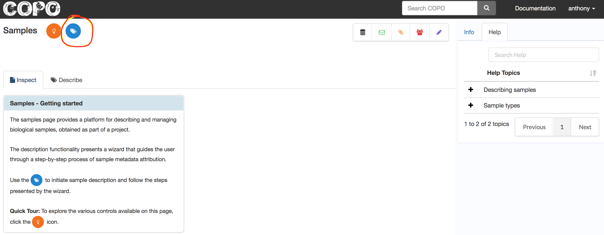
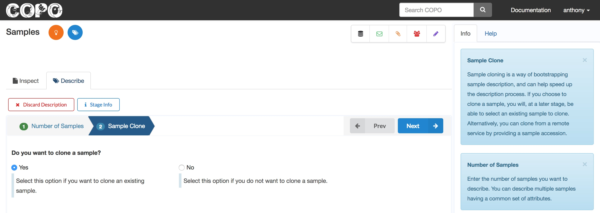
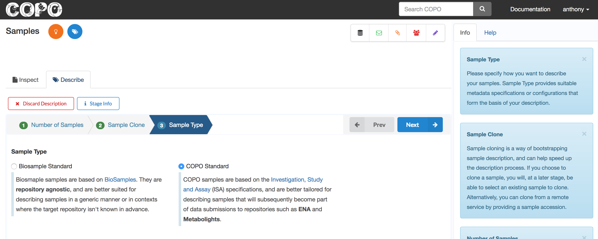

####################
Samples
####################

The samples page enables users to describe and manage biological samples. 

Samples within a profile can be linked to, or form part of, other components within a profile. For instance, a sample may be linked to a datafile as a metadata. The screenshot below shows the sample page before any record has been added.

COPO provides a wizard to aid in the process of entering samples. 

1. Click the **Describe samples** icon (see the highlighted icon in the screenshot above) to initiate the **sample wizard**

.. hint:: 

   The sample wizard is a sequence of steps that guides the user through the process of describing samples.
   
2. Enter the number of samples to describe in the first stage of the wizard. COPO provides for the description of multiple samples having a common set of attributes.

.. image:: images/sample-no-of-samples.jpg

Before proceeding through the stages of the wizard, there are a few controls worth pointing out on the page as captured in the screenshot above.

Discard Description (left side of the wizard)
   Click this to discard and exit the current description. Please not that this action is irreversible.

Stage Info (next to the discard description button)
   Click this at any stage of the description to display information relevant to the stage.
   
Prev & Next (right side of the wizard)
   Use this to go forward and backward through the description stages
   
Info panel (right side corner of the page)
   This panel displays information about user interaction within a component page (e.g., feedback after record creation). In the wizard description context, it displays stage information as a user goes through different stages of a description.
   
Help panel (right side corner of the page)
   Click this tab to access context-based help about the samples page. This panel is also available to other components (e.g., Datafile)

3. When describing new samples, the user can choose to inherit metadata from an existing sample. This may be useful in situations where the samples to be described have similar attributes to an existing one. By default, this property is set to **not** inherit or clone. For the purpose of this documentation, we will set clone to **Yes**.

.. note:: 

   You can clone only if there are existing samples in the current profile. This implies that sample cloning is currently restricted to samples within the same profile.
   
4. Select the sample type. This selection will determine the metadata template to use in generating the target samples. This will also impact on the suitability of the generated samples for submission to certain repositories.

.. hint:: 

   Select **COPO Standard** sample type for samples that will form part of submissions to the European Nucleotide Archive (ENA).
   
 
   
  

